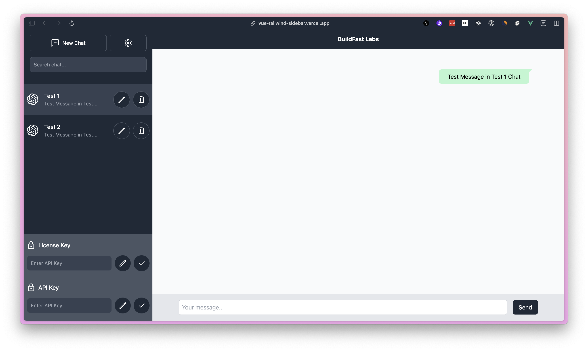

I have built a intuitive UI for the left panel of a AI chat interface using VueJs.

Users can :

- Create new chats
- Edit chat titles
- Delete Chats
- Toggle between chats
- Add API / License keys

